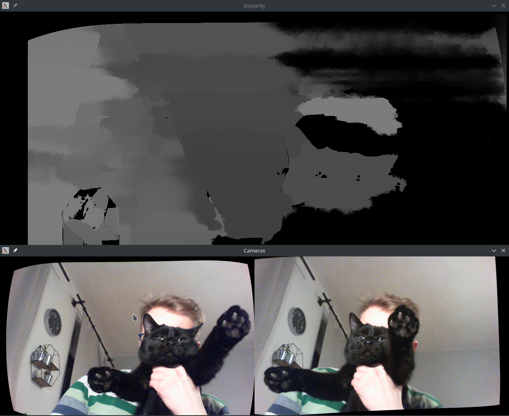

# Stereo On Steroids
My master thesis POC about possibilities of speeding up stereo vision (generating depth map) based on OpenCV library.

## How it works?
Save images pairs from camera by running
`./read`
and pressing any key. Press ESC key to exit.

calibrate left and right camera separetly using
`./calibrate`
and calibrate camera system using
`./calibrate-stereo`.
Output files will generate: for each camera and set of cameras.

Then remove distortion and rectify images using
`./undistort_rectify`.
Output images with suffix "old" will appear.

Generate disparity map by running `./disparity`. It creates disparity map of live images from cameras and shows

  
   Example images from cameras with generated disparity map.

## TODO
- Make multiproessing work

## Done
- Collecting images from cameras
- Calibration
- Disparity map generation
- Disparity map from live image generation
- Timer

## Tips
- on Manjaro Linux: build OpenCV with flag `CMAKE_EXE_LINKER_FLAGS=-lcblas` ([solution found here](https://unix.stackexchange.com/questions/417032/arch-linux-problems-building-opencv-with-cuda-libopencv-core-so-3-4-0-undefin)); added this flag to CMakeLists.txt
